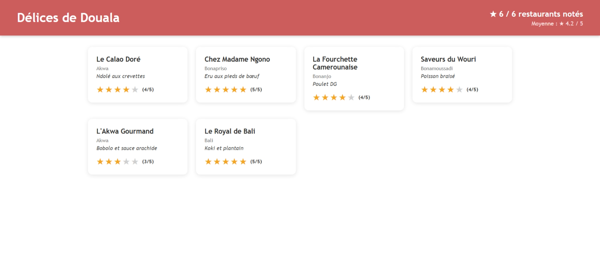
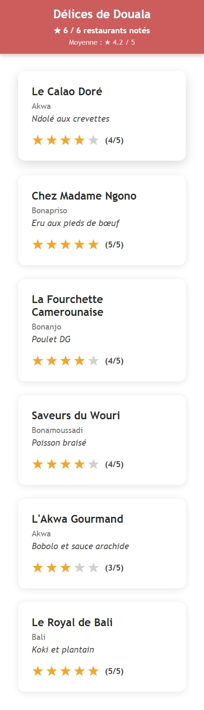

# Délices de Douala — Notation de restaurants

> Application de notation de restaurants camerounais à Douala.
> Projet réalisé dans le cadre d'Angular Talent Lab 2026.

## Captures d'écran

### Desktop


### Mobile


## Technologies utilisées
  - Angular 22.0.1 - TypeScript 5.9+ - npm 11.17.0

## Fonctionnalités
  - ✅ Layout responsive (Desktop / Tablette / Mobile)
  - ✅ Liste de 6 restaurants de Douala
  - ✅ Notation par étoiles (1 à 5) par restaurant
  - ✅ Retrait de note en cliquant sur la même étoile
  - ✅ Compteur de restaurants notés en temps réel
  - ✅ Moyenne globale des notes calculée dynamiquement
  - ✅ Header sticky avec statistiques de notation

## Lancer le projet en local

```bash
git clone https://github.com/[VOTRE_USERNAME]/delices-de-douala-tp.git
cd delices-de-douala-tp
npm install
npm start --open
```

Ouvrir [http://localhost:4200](http://localhost:4200).

## Auteur
ATL 2026 — TP notation — Délices de Douala
Nlend Max — Apprenant Angular Talent Lab 2026 — Cohorte Douala
